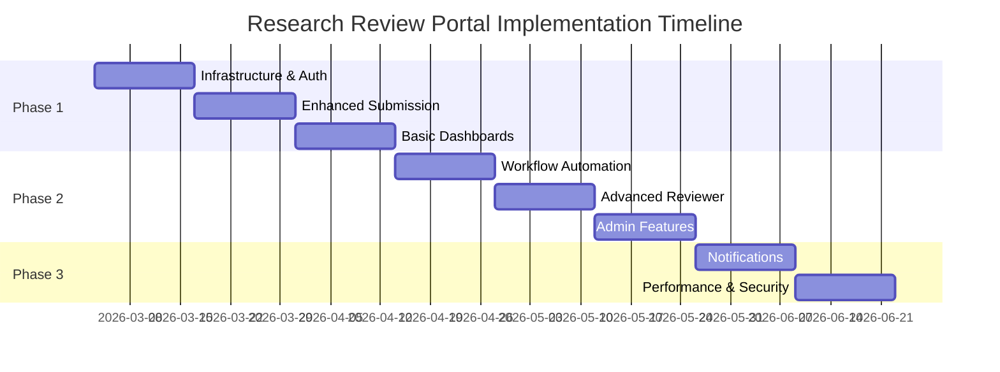

# Research Review Portal - Requirements Document

## Project Overview

The Research Review Portal is a comprehensive web-based application for managing the submission, review, and approval of research documents at City University. The system facilitates a multi-stage review process where researchers submit documents that must be approved by multiple reviewers in a sequential manner.

## Current System Status

The system is currently implemented as a **WordPress plugin** with the following existing capabilities:
- Multi-stage review workflows for different submission types (Conference, Publication, Student Project, Grant)
- JSON-based data storage for submissions, reviewers, and configuration
- REST API endpoints for core functionality
- Basic file attachment support
- Sequential reviewer assignment and feedback system

## Scope of Work Required

### 1. User Management & Authentication System

#### 1.1 User Roles
- **Students/Researchers** - Submit documents and track progress
- **Reviewers** - Review assigned documents and provide feedback
- **Administrators** - Manage the entire system and all submissions
- **Coordinators** - Assign reviewers and manage workflow processes

#### 1.2 Authentication Features
- **Secure login system** integrated with WordPress user management
- **Role-based access control** with proper permissions
- **Single Sign-On (SSO)** integration with university systems - Microsoft Entra Id
- **Session management** with appropriate timeout policies

### 2. Document Submission System

#### 2.1 Enhanced Submission Process
- **Improved submission form** with field validation and real-time feedback
- **Multiple file upload support** with file type restrictions and size limits
- **Draft saving capability** to allow users to save incomplete submissions
- **Submission preview** before final submission
- **Confirmation emails** upon successful submission
- **Anonymous process documentation** - Public pages explaining submission and review process for each type

#### 2.2 Submission Types (Currently Supported)
- **Conference Papers** - Academic conference submissions
- **Publications** - Journal articles and research papers
- **Student Projects** - Capstone projects and research proposals
- **Grant Proposals** - Funding applications and research grants

#### 2.3 Metadata Management
- **Automated ID generation** (already implemented: ARS, PUB, PROJ, GRN prefixes)
- **Keywords and research area classification**
- **Submission deadlines** and due date enforcement
- **Version control** for revised submissions

### 3. Multi-Stage Review Workflow

#### 3.1 Review Stage Configuration (Currently Partially Implemented)
Each submission type has predefined stages with configurable reviewer requirements:

**Conference Submissions:**
- Initial Screening (1 reviewer)
- Reviewer Assignment (1 reviewer)  
- Peer Review (2 reviewers)
- Review Consolidation (2 reviewers)
- Final Decision (1 reviewer)
- Confirmation (1 reviewer)

**Publication Submissions:**
- Administrative Check (1 reviewer)
- Reviewer Matching (1 reviewer)
- Expert Review (2 reviewers)
- Director Assessment (2 reviewers)
- Final Decision (1 reviewer)
- Tracking (1 reviewer)

**Student Projects:**
- Advisor Matching (1 reviewer)
- Advisor Consultation (1 reviewer)
- Feasibility Check (1 reviewer)
- Director Approval (1 reviewer)
- Project Setup (1 reviewer)
- Milestone Tracking (1 reviewer)

**Grant Proposals:**
- Compliance Check (1 reviewer)
- Review Assignment (1 reviewer)
- Multi-Criteria Review (2 reviewers)
- Committee Meeting (2 reviewers)
- Final Decision (1 reviewer)
- Development Support (1 reviewer)
- Submission Tracking (1 reviewer)

#### 3.2 Workflow Management Requirements
- **Automatic progression** to next stage when all reviewers approve
- **Revision handling** - send back to submitter when revisions requested
- **Parallel review support** for stages requiring multiple reviewers
- **Reviewer assignment algorithms** (random, expertise-based, workload-based)
- **Escalation procedures** for overdue reviews
- **Stage skipping capability** for administrators

### 4. Reviewer Management System

#### 4.1 Enhanced Reviewer Dashboard
- **Pending reviews list** with submission details and due dates
- **Review history** and workload tracking
- **Calendar integration** for deadline management
- **Easy access to submission documents** and attachments
- **Streamlined decision interface** (Approve/Request Revision/Reject)
- **Rich text feedback editor** with formatting options

#### 4.2 Review Process Features
- **Conflict of interest declaration** and management
- **Review criteria templates** specific to submission types
- **Scoring/rating system** for quantitative assessments
- **Collaborative review features** for multi-reviewer stages
- **Review timeline tracking** and reminder system

### 5. Status Tracking & Notifications

#### 5.1 Student/Submitter Features
- **Real-time status dashboard** showing current stage and progress
- **Detailed timeline view** of all review activities
- **Document version tracking** with change history
- **Notification system** for status updates and required actions
- **Estimated completion dates** based on current stage

#### 5.2 Notification System
- **Email notifications** for all stakeholders
- **In-app notification center** with read/unread status
- **Configurable notification preferences** by user role
- **Automatic reminder system** for approaching deadlines
- **Escalation notifications** for overdue items

### 6. Administrative Features

#### 6.1 System Administration
- **Comprehensive dashboard** with system-wide statistics
- **All submissions overview** with filtering and search capabilities
- **User management** for adding/removing reviewers and users
- **System configuration** for review stages and requirements
- **Bulk operations** for reviewer assignments and status updates

#### 6.2 Reporting & Analytics
- **Review time analytics** and bottleneck identification
- **Reviewer workload reports** and performance metrics
- **Submission trend analysis** by type and time period
- **Export capabilities** for data analysis
- **Audit trail** for all system activities

### 7. Due Date & Deadline Management

#### 7.1 Deadline Enforcement
- **Configurable review deadlines** per stage and submission type
- **Automatic deadline calculation** based on submission date
- **Grace period handling** with escalation procedures
- **Holiday and weekend consideration** in deadline calculations
- **Extension request system** for reviewers

#### 7.2 Calendar Integration
- **Deadline calendar view** for all stakeholders
- **Personal calendar integration** (Google Calendar, Outlook)
- **Meeting scheduling** for collaborative reviews
- **Availability checking** for reviewer assignments

### 8. Technical Requirements

#### 8.1 Platform & Compatibility
- **WordPress 5.0+** compatibility (current requirement)
- **PHP 7.4+** support (current requirement)
- **Responsive design** for mobile and tablet access
- **Cross-browser compatibility** (Chrome, Firefox, Safari, Edge)
- **Accessibility compliance** (WCAG 2.1 standards)

#### 8.2 Performance & Security
- **Database optimization** for large data sets
- **File security** with access control and virus scanning
- **Data backup and recovery** procedures
- **SSL/TLS encryption** for all communications
- **Input validation and sanitization** for security

#### 8.3 Integration Requirements
- **REST API expansion** for external integrations
- **WordPress user system integration** for authentication
- **Email system integration** for notifications
- **File storage optimization** with cleanup procedures
- **Export/import functionality** for system migration

### 9. Current System Enhancements Needed

#### 9.1 Data Structure Improvements
- **Enhanced user profiles** with department and expertise information
- **Better review criteria storage** with templates
- **Improved file metadata** and version tracking
- **Performance optimization** for large submission volumes

#### 9.2 User Interface Enhancements
- **Modern, intuitive UI design** with improved user experience
- **Dashboard customization** per user role
- **Advanced search and filtering** capabilities
- **Bulk action support** for administrators
- **Mobile-responsive design** improvements

### 10. Implementation Priorities

#### Phase 1: Core Enhancements (High Priority)
1. Enhanced authentication and user management
2. Improved reviewer dashboard with due dates
3. Enhanced student status tracking
4. Basic notification system
5. Administrative oversight dashboard

#### Phase 2: Workflow Automation (Medium Priority)
1. Automatic workflow progression
2. Advanced deadline management
3. Comprehensive notification system
4. Reporting and analytics
5. Calendar integration

#### Phase 3: Advanced Features (Low Priority)
1. SSO integration
2. Advanced analytics and reporting
3. Mobile application
4. API expansions for third-party integrations
5. Advanced collaboration features

### 11. Success Criteria

- **100% of submissions** can be tracked from submission to final decision
- **All reviewers** have access to user-friendly dashboards with clear deadlines
- **All students** can track their submission status in real-time
- **Administrators** have complete oversight of all submissions and system performance
- **Average review time** is reduced by 30% through automation and better workflow management
- **User satisfaction** rating of 4.5/5 or higher from all user groups

### 12. Constraints & Assumptions

#### Technical Constraints
- Must work within WordPress plugin architecture
- Must maintain compatibility with existing data structure
- Must support current JSON-based data storage (with option for database migration)

#### Business Assumptions
- University email system available for notifications
- Users have basic computer literacy
- Reviewers are available for timely reviews
- Administrative support for system maintenance and user training

### 13. Future Enhancements

- **Machine learning** for automatic reviewer assignment based on expertise
- **Advanced analytics** with predictive modeling for review times
- **Integration** with research databases and academic systems
- **Blockchain** integration for document verification and audit trails
- **AI-powered** initial document screening and quality checks

---

## Implementation Plan

### Phase 1: Foundation & Core Features (Weeks 1-6)

#### Sprint 1: Infrastructure & Authentication (Weeks 1-2)
**Tasks:**
- [ ] **Code Audit & Documentation** (3 days)
  - Review existing WordPress plugin architecture
  - Document current API endpoints and data flow
  - Identify technical debt and improvement areas
  - Create development environment setup guide

- [ ] **Enhanced User Management** (5 days)
  - Extend WordPress user roles with custom capabilities
  - Implement role-based access control (RBAC)
  - Create user profile extensions for department/expertise
  - Add bulk user import functionality

- [ ] **Anonymous Process Documentation** (4 days)
  - Create comprehensive process explanation pages for each submission type
  - Build interactive workflow visualization
  - Add estimated timeline information for each stage
  - Implement public access without authentication requirements

**Deliverables:**
- Updated plugin with enhanced authentication
- User management documentation
- SSO configuration guide
- Development environment ready

#### Sprint 2: Enhanced Submission System (Weeks 3-4)
**Tasks:**
- [ ] **Improved Submission UI** (6 days)
  - Redesign submission form with modern UI/UX
  - Add real-time field validation
  - Implement draft saving functionality
  - Create submission preview feature

- [ ] **File Management Enhancement** (4 days)
  - Improve file upload with progress indicators
  - Add file type validation and virus scanning
  - Implement file versioning system
  - Create secure file access controls

**Deliverables:**
- Enhanced submission interface
- Improved file handling system
- User testing feedback incorporated

#### Sprint 3: Basic Dashboard & Status Tracking (Weeks 5-6)
**Tasks:**
- [ ] **Student Dashboard** (5 days)
  - Create submission status tracking interface
  - Build timeline view for review progress
  - Add notification center
  - Implement search and filter functionality

- [ ] **Basic Reviewer Dashboard** (5 days)
  - List pending reviews with due dates
  - Create simple review decision interface
  - Add basic feedback submission form
  - Implement reviewer notification preferences

**Deliverables:**
- Student dashboard with status tracking
- Basic reviewer interface
- Initial notification system

### Phase 2: Advanced Workflow & Features (Weeks 7-12)

#### Sprint 4: Workflow Automation (Weeks 7-8)
**Tasks:**
- [ ] **Automated Stage Progression** (6 days)
  - Implement automatic workflow advancement logic
  - Create revision request handling
  - Build reviewer assignment algorithms
  - Add stage skipping for administrators

- [ ] **Deadline Management** (4 days)
  - Implement configurable deadline calculation
  - Create escalation procedures for overdue items
  - Add grace period and extension handling
  - Build deadline notification system

**Deliverables:**
- Fully automated workflow engine
- Deadline management system
- Escalation procedures implemented

#### Sprint 5: Advanced Reviewer Features (Weeks 9-10)
**Tasks:**
- [ ] **Enhanced Reviewer Dashboard** (6 days)
  - Add calendar integration for deadlines
  - Create review criteria templates
  - Implement scoring/rating system
  - Build collaborative review features

- [ ] **Review Process Optimization** (4 days)
  - Add conflict of interest management
  - Create review history tracking
  - Implement workload balancing
  - Build reviewer analytics

**Deliverables:**
- Advanced reviewer dashboard
- Comprehensive review process
- Reviewer analytics system

#### Sprint 6: Administrative Features (Weeks 11-12)
**Tasks:**
- [ ] **Admin Dashboard** (6 days)
  - Create system-wide statistics dashboard
  - Build submission management interface
  - Add bulk action capabilities
  - Implement system configuration UI

- [ ] **Reporting & Analytics** (4 days)
  - Create review time analytics
  - Build reviewer performance metrics
  - Add submission trend analysis
  - Implement data export functionality

**Deliverables:**
- Comprehensive admin dashboard
- Reporting and analytics system
- System configuration interface

### Phase 3: Polish & Optimization (Weeks 13-16)

#### Sprint 7: Notification & Communication (Weeks 13-14)
**Tasks:**
- [ ] **Advanced Notification System** (6 days)
  - Implement email notification templates
  - Create in-app notification center
  - Add notification preference management
  - Build automated reminder system

- [ ] **Communication Features** (4 days)
  - Add reviewer-submitter communication
  - Create internal messaging system
  - Implement comment threading
  - Build notification delivery tracking

**Deliverables:**
- Complete notification system
- Enhanced communication features
- Email template library

#### Sprint 8: Performance & Security (Weeks 15-16)
**Tasks:**
- [ ] **Performance Optimization** (5 days)
  - Optimize database queries and caching
  - Implement file storage optimization
  - Add pagination for large datasets
  - Create performance monitoring

- [ ] **Security Hardening** (3 days)
  - Implement comprehensive input validation
  - Add file security scanning
  - Create audit trail system
  - Conduct security testing

- [ ] **Microsoft Entra ID Integration** (4 days)
  - Configure Entra ID application registration
  - Implement SAML/OAuth2 authentication flow
  - Create fallback authentication for external users
  - Test SSO integration and user provisioning

- [ ] **Final System Integration** (3 days)
  - Complete SSO testing and validation
  - Integrate all authentication methods
  - Finalize security configurations
  - Prepare production deployment

**Deliverables:**
- Optimized system performance
- Enhanced security measures
- Complete SSO integration with Microsoft Entra ID
- Production-ready system with all authentication methods
- Audit trail implementation

### Implementation Timeline

### Resource Requirements

#### Development Team
- **1 Senior Full-Stack Developer** (WordPress/PHP expert)
- **1 Frontend Developer** (React/JavaScript specialist)
- **1 UI/UX Designer** (part-time, first 8 weeks)
- **1 DevOps/Security Specialist** (part-time, weeks 9-16)

#### Technical Infrastructure
- **Development Environment**: WordPress development setup with version control
- **Testing Environment**: Staging server for integration testing
- **CI/CD Pipeline**: Automated testing and deployment
- **Monitoring Tools**: Performance and error monitoring

### Risk Assessment & Mitigation

#### High Risk
🔴 **Microsoft Entra ID Integration Complexity**
- *Risk*: SSO integration delays due to university IT policies
- *Mitigation*: Start Entra ID setup early, have fallback authentication ready

🔴 **Data Migration from Current System**
- *Risk*: Data loss or corruption during enhancement
- *Mitigation*: Comprehensive backup strategy, incremental migration

#### Medium Risk
🟡 **Performance with Large Data Sets**
- *Risk*: System slowdown with hundreds of submissions
- *Mitigation*: Early performance testing, database optimization

🟡 **User Adoption Resistance**
- *Risk*: Users preferring old system or manual processes
- *Mitigation*: User training program, gradual rollout strategy

#### Low Risk
🟢 **Browser Compatibility Issues**
- *Risk*: Features not working in older browsers
- *Mitigation*: Progressive enhancement, fallback features

### Testing Strategy

#### Automated Testing (Weeks 1-16)
- **Unit Tests**: 80% code coverage for core functionality
- **Integration Tests**: API endpoint testing with automated scripts
- **Performance Tests**: Load testing with simulated user traffic

#### User Acceptance Testing (Weeks 11-16)
- **Alpha Testing** (Week 11): Internal team testing
- **Beta Testing** (Weeks 12-14): Limited user group (10-15 users)
- **Production Testing** (Weeks 15-16): Soft launch with monitoring

#### Security Testing (Weeks 15-16)
- **Penetration Testing**: Third-party security assessment
- **Vulnerability Scanning**: Automated security scanning
- **Code Review**: Security-focused code review

### Deployment Strategy

#### Pre-Production (Week 15)
- **Staging Deployment**: Full system testing in production-like environment
- **Data Migration Testing**: Verify all existing data transfers correctly
- **Performance Baseline**: Establish performance metrics

#### Production Rollout (Week 16)
- **Soft Launch**: Limited user access (25% of users)
- **Monitoring Phase**: 48-hour intensive monitoring
- **Full Launch**: Complete system activation
- **Post-Launch Support**: 2-week intensive support period

### Success Metrics

#### Technical Metrics
- **System Uptime**: 99.9% availability
- **Response Time**: < 2 seconds for all page loads
- **Error Rate**: < 0.1% of all requests

#### Business Metrics
- **User Adoption**: 90% of reviewers using new system within 4 weeks
- **Review Time Reduction**: 30% faster average review completion
- **User Satisfaction**: 4.5/5 rating from user surveys

#### Quality Metrics
- **Bug Reports**: < 5 critical bugs in first month
- **Support Tickets**: < 10% of users requiring support
- **Training Completion**: 95% of users complete onboarding

### Post-Implementation Support

#### Immediate Support (Weeks 17-20)
- Daily system monitoring and issue resolution
- User support and training assistance
- Performance optimization based on usage patterns
- Bug fixes and minor feature adjustments

#### Ongoing Maintenance
- **Weekly**: System health checks and performance monitoring
- **Monthly**: User feedback review and feature planning
- **Quarterly**: Security updates and system optimization
- **Annually**: Major feature releases and technology updates

---

## Next Steps

1. **Stakeholder Approval** - Present implementation plan to university leadership
2. **Team Assembly** - Recruit and onboard development team
3. **Environment Setup** - Prepare development and staging environments
4. **Kick-off Meeting** - Initiate Sprint 1 with full team
5. **Entra ID Coordination** - Begin Microsoft Entra ID integration setup with IT department

This comprehensive implementation plan provides a structured approach to enhancing the Research Review Portal while minimizing risks and ensuring successful delivery of all required features.